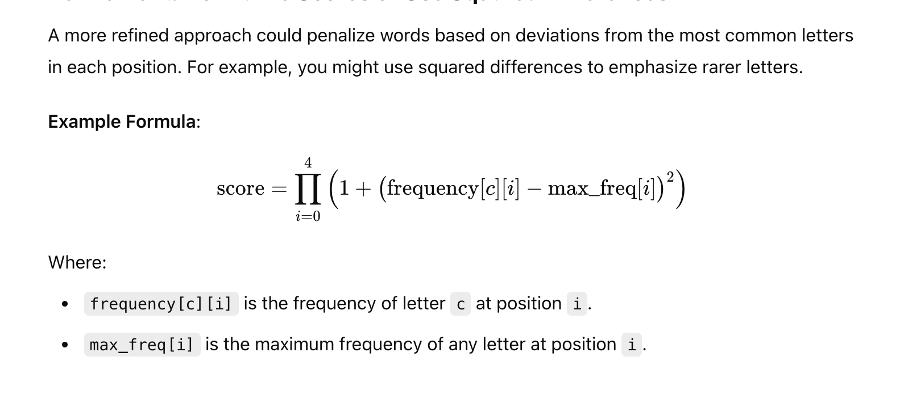

# Runbook

## Algorithm
 1. Initiate the candidates via loading from the file
 2. Choose the first guess(E.g. 'slate')
 3. Make a guess and get the feedback by calling the Votee API
 4. Filter the candidates basing on the feedback
 5. Choose the next guess(a optimal guess). To get the optimal guess, we use the scoring algorithm based-on frequency of the letters.
 6. Repeat step 3-5 until the word is guessed

## Formula for scoring word

Reference: ChatGpt and https://www.youtube.com/watch?v=v68zYyaEmEA
## How to run
### Prerequisites
1. Install Java environment
2. Java 17 or above

### Run the program in supported IDE
1. Open the project in the IDE
2. Run the program (run Main.class)
3. The program will start guessing the word
4. Input the seed number 

Input 'exit' to stop the program